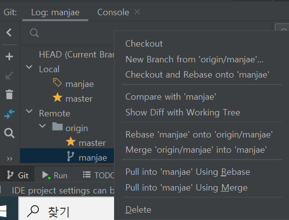

# branch에서 작업하는 방법
## 1. 새 브랜치 생성

## 2. 로컬 저장소에 브랜치 만들기

자신이 만든 원격 저장소의 브랜치로 로컬 저장소에 브랜치를 만듭니다.

## 3. 로컬 저장소에서 커밋하면서 작업하기

## 4. 원격 저장소의 자신이 만든 브랜치로 push
**이 때 origin/master가 아닌 origin/자신이 만든 브랜치 로 push 해야 합니다.**

## 5. github로 돌아와 Pull Request 생성
